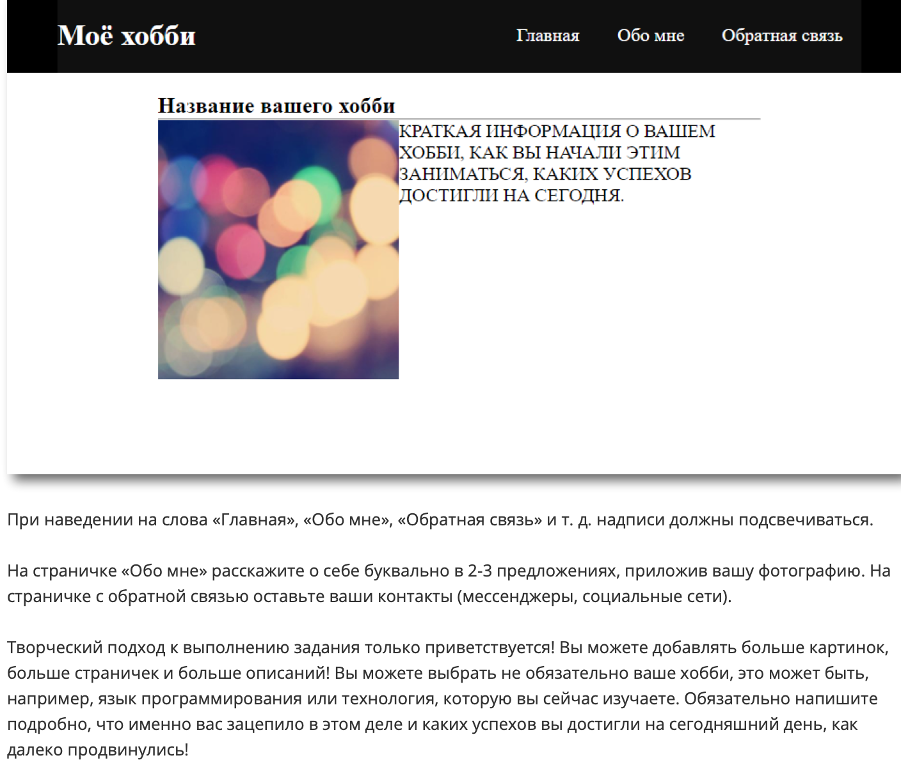

Привет, меня зовут **Алина** 👋

Учусь на курсе  

**Fullstack разработчик на Python**
 

Это начало блока **Frontend-разработка**


[](https://git.io/typing-svg)

---
**Задание:**



**Решение:**

Созданы три ````.html```` файла(````Главная```` страница, страница ````Обо мне````, страница ````Обратная связь````)

Создан ````.css```` файл, где расписаны стили

----
```` Спасибо за уделенное время! 🙏 ````

___


[](https://github.com/anuraghazra/github-readme-stats)